# RTF decomposer

Tool for extracting various embedded object types from a given RTF file or a whole folder repository.

## Presentation :

I decided to release this tool to the public in order to assist fellow <b>Malware Analysts</b> & <b>Antivirus Engineers</b> at their daily tasks while dealing with <b>obfuscated RTF objects</b>. Like you perfectly know : manual extraction of <b>embedded RTF data</b> is such a painful process. As for the other available public alternatives, without taking anything away from the excellent work done by their respective authors, I honestly think that some are simply very outdated and thus unable to cope with obfuscated data and the most current ones are somehow limited by either a bad design or by some kind of hacky implementations. I don't claim that my tool is perfect either, its just supposed to succeed where most of the other available public alternatives fail.

## Usage :

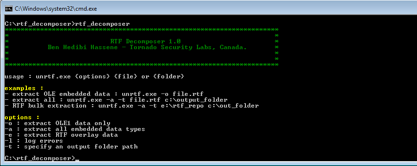

Command line options are pretty straightforward. If you omit to specify a <b>destination folder</b> using the <b>-t</b> switch, then the extracted data will be placed inside the tool's executable folder. Please note that the tool doesn't create folders, thus the specified destination folder has to be created beforehand. 

The <b>-l</b> switch enables error logging. All encountered errors while extracting <b>RTF</b> embedded data will be then logged. In case of bugs or data extraction's error please feel free to contact me so I can release a fix.

Please note that extracted data's file names follows this naming scheme : <b>{original_file_name}_{extracted data_type}</b> where :

<b>_OLE</b> : OLE1 native data.

<b>_OVL</b> : RTF Overlay data.

<b>_STG</b> : RTF Storage data.

etc..

## Examples :

#### Bulk extracting a small folder repository

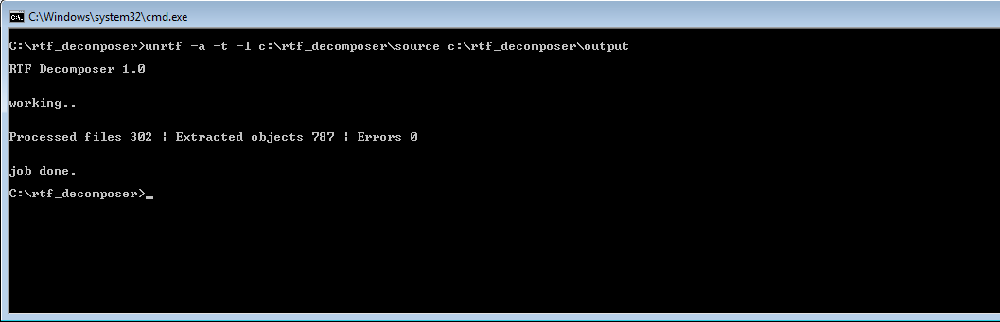

#### Extracted data

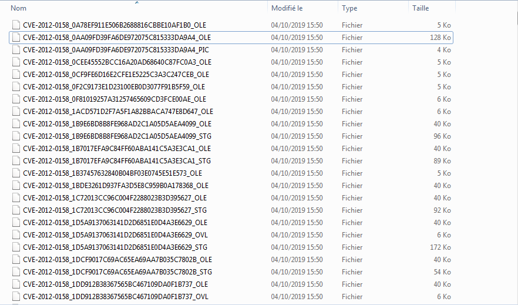

#### OLE1 data

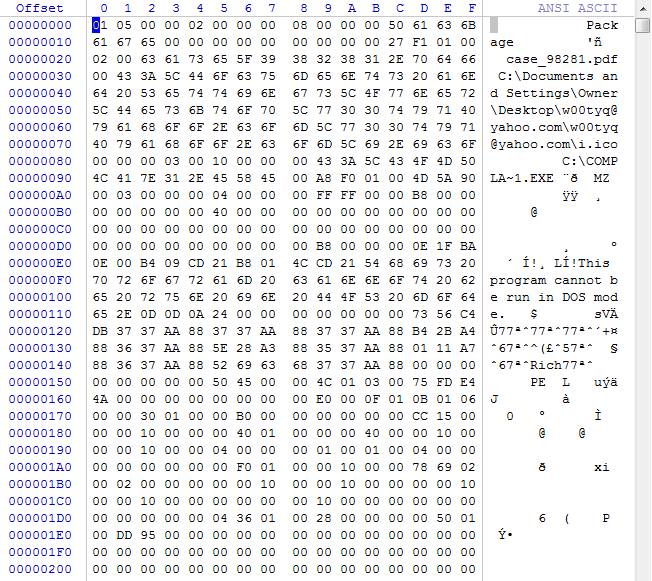

#### OLE1 data

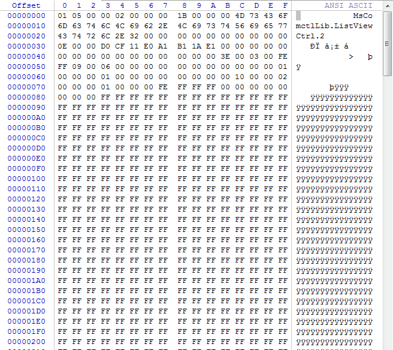

#### RTF Storage data

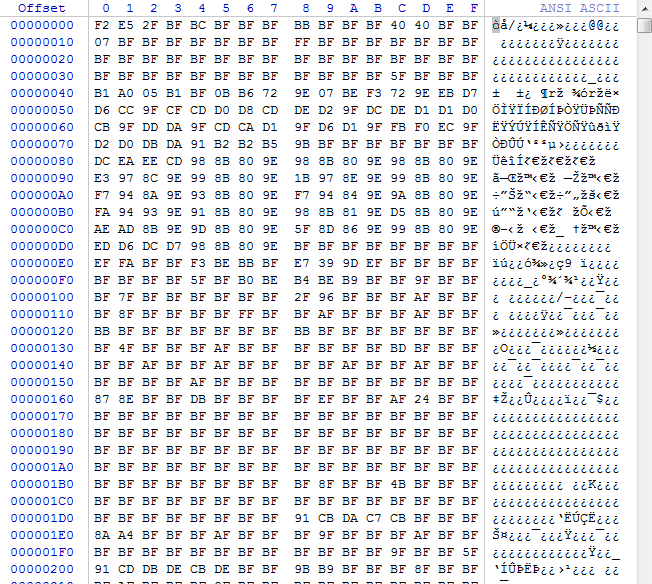

Clearly visible that the data is simply encrypted with a simple <b>xor algorithm</b>, the encryption key is a crystal clear <b>0xBF</b>

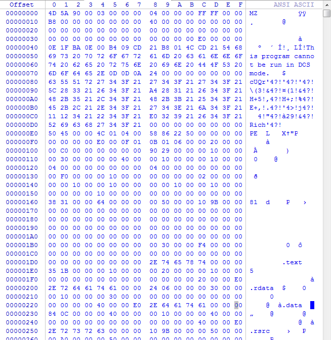

## Side notes : 

While the very excellent <a href="https://github.com/decalage2/oletools/blob/master/oletools/rtfobj.py">rtfobj</a> simply fails to extract any valuable embedded data from the hand crafted <b>issue_251.rtf</b> file.

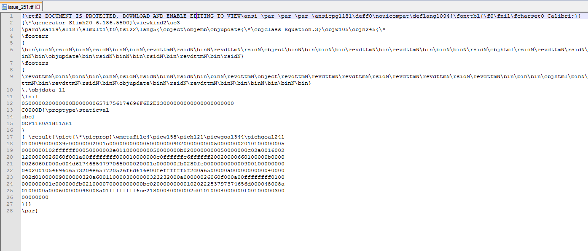

<b>RTF Decomposer</b> on the other hand have no problem extracting both the truncated <b>OLE</b> data and the embedded <b>picture</b>.

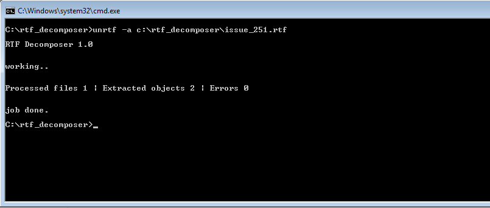
##### Extracted data
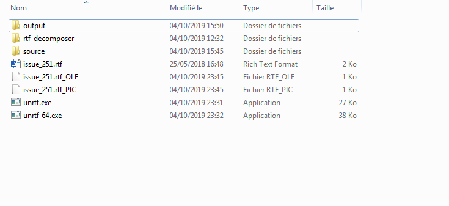
##### Truncated OLE data
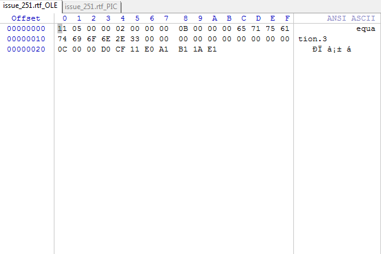
##### WMF Embedded picture
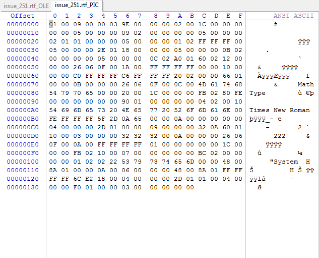
##### 222zzzzzz hehe
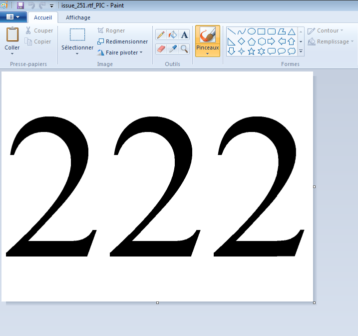

## Closing notes :

<b>RTF Decomposer</b> doesn't detect <b>exploits</b> nor <b>decrypts</b> data ( if you want such exciting features then join me at <b>Tornado Security Labs</b> LOLLLL ). Its just a simple tool meant for <b>RTF</b> embedded data extraction where <b>high speed</b> and <b>accuracy</b> are of paramount importance.

The 32bit version of <b>RTF Decomposer</b> may trigger a bogus signature within Kaspersky Antivirus database. Its neither a <b>packed</b> executable nor a <b>katusha virus</b>, its just program written in pure <b>Ansi C</b> :))) 

And I quote this Mahatma Gandhi's famous punch line : <a href="https://www.youtube.com/watch?v=yoYZf-lBF_U">Cause ain't no such things as halfway crooks, scared to death, scared to look, they shook !!</a>
